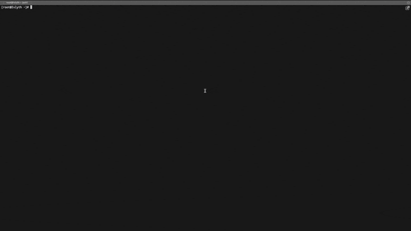

`process-bandwidth` is an ebpf based program which focus on process's network bandwidth (include each connection).
it provides a clean terminal UI based on [tview](https://github.com/rivo/tview) (as a CLI tool), and provides a 
simple API to export data for prometheus (as a long-running task).

### Usage
in `top` mode, you can open/close settings by press `F4`, exit by press `ESC` or CTRL+C, and pause/resume the update by 
press `F5`, and you can click on the table header line (currently only support `In`, `Out`, `Total`) to change the sort 
column and order 

also you can use `tab` to change focus between process's table and connection's table, and you can use up/down keys to  
scroll in the table, press the Enter key to choose current process or connection

### Requirements
linux kernel version >= 4.18 

### Installation
please download through GitHub's release page, or you can build your own by just run `make` under the root 
directory of the project

### Filter

##### filter processes (default mode)
- GetConnections.ConnectionInfo.LocalPort=9091 or Name=java

##### filter connections (you should check the Connes and uncheck the Process)
ConnectionInfo.LocalPort = 2181 or ConnectionInfo.LocalPort = 9091

##### filter both (you should check the both)
> Note: filter processes and connections at the same time it's only meaningful that you filter processes based on connection
and you want see connections only satisfies the filter for process. so we just use `or` to concat two (or more) filter,
but we known that one is for process and another is for connection. 

GetConnections.ConnectionInfo.LocalPort = 2181 or ConnectionInfo.LocalPort = 2181

> filter function implement based on [uni-filter](https://github.com/Ivlyth/uni-filter), see more document [here](https://github.com/Ivlyth/uni-filter/blob/main/README.md)

## Thanks

- [tview](https://github.com/rivo/tview)
- [asciigraph](https://github.com/guptarohit/asciigraph)
  - I made a [copy](https://github.com/Ivlyth/process-bandwidth/blob/main/pkg/asciigraph) to support colors in tview's TextView component
- [ebpf](https://github.com/cilium/ebpf)
- [eCapture](https://github.com/ehids/ecapture)
